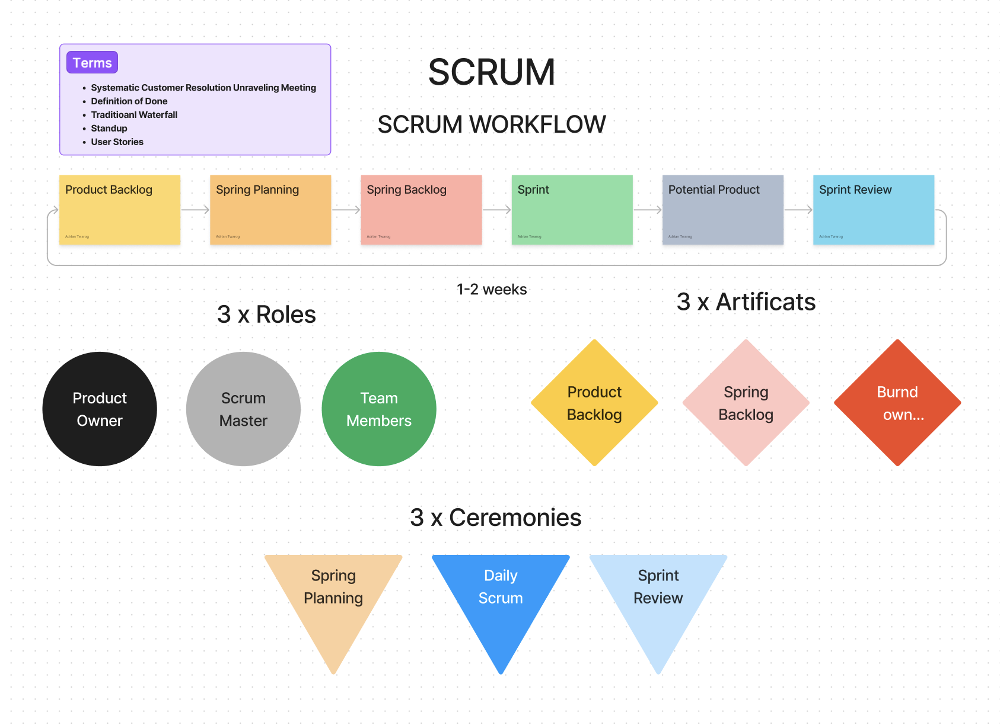

# Support de Cours sur les Méthodes Agiles et la Gestion de Projet

## Table des matières
1. [Introduction à Agile](#introduction-à-agile)
2. [Le Manifest Agile](#le-manifest-agile)
3. [SCRUM](#scrum)
4. [Kanban](#kanban)
5. [Extreme Programming (XP)](#extreme-programming-xp)
6. [User Stories](#user-stories)
7. [Personas](#personas)
8. [Veille Technologique](#veille-technologique)
9. [Diagrammes UML](#diagrammes-uml)
10. [Méthode Merise](#méthode-merise)
11. [Résumé sur Git, DevOps et CI/CD](#résumé-sur-git-devops-et-cicd)

## Introduction à Agile
Les méthodes agiles sont des approches itératives et incrémentales pour le développement de logiciels. Elles se concentrent sur la collaboration, la flexibilité et la livraison rapide de produits fonctionnels.

  
En savoir plus

  Les principales caractéristiques des méthodes agiles incluent :
  - Des cycles de développement courts appelés itérations ou sprints.
  - Une forte collaboration entre les équipes de développement et les parties prenantes.
  - Une capacité à s'adapter rapidement aux changements de besoins.
  - Un accent sur la livraison fréquente de versions fonctionnelles du produit.

## Le Manifest Agile
Le Manifest Agile est un ensemble de valeurs et de principes pour guider le développement logiciel agile.

### Les 4 valeurs fondamentales
1. Les individus et leurs interactions plus que les processus et les outils.
2. Des logiciels opérationnels plus qu’une documentation exhaustive.
3. La collaboration avec les clients plus que la négociation contractuelle.
4. L’adaptation au changement plus que le suivi d’un plan.

### Les 12 principes
- La satisfaction du client par la livraison rapide et continue de logiciels fonctionnels.
- Accueillir positivement les changements de besoins, même tard dans le projet.
- Livrer fréquemment des logiciels opérationnels.
- Collaboration quotidienne entre les développeurs et les parties prenantes.
- Construire des projets autour d’individus motivés.
- Préférence pour la communication en face à face.
- Un logiciel fonctionnel est la principale mesure de progression.
- Maintenir un rythme de développement soutenable.
- Une attention continue à l'excellence technique et à la bonne conception.
- Simplicité – l'art de maximiser la quantité de travail non fait.
- Les meilleures architectures, spécifications et conceptions émergent d'équipes auto-organisées.
- Réfléchir régulièrement aux moyens de devenir plus efficaces, puis ajuster son comportement en conséquence.

## SCRUM
SCRUM est un cadre agile populaire pour la gestion de projet, mettant l'accent sur des sprints itératifs et incrémentaux.

### Les rôles
- **Product Owner** : Responsable de maximiser la valeur du produit et de gérer le backlog.
- **Scrum Master** : Facilite le processus SCRUM, élimine les obstacles.
- **Équipe de Développement** : Les professionnels qui livrent le produit fini.

### Les artefacts
- **Product Backlog** : Liste ordonnée des éléments à réaliser pour le produit.
- **Sprint Backlog** : Liste des tâches à accomplir pendant un sprint.
- **Increment** : Ensemble des éléments terminés à la fin d'un sprint.

### Les événements
- **Sprint** : Cycle de développement de 1 à 4 semaines.
- **Sprint Planning** : Réunion pour planifier les tâches du sprint.
- **Daily Scrum** : Réunion quotidienne de 15 minutes pour synchroniser l'équipe.
- **Sprint Review** : Réunion pour examiner l'increment et ajuster le backlog.
- **Sprint Retrospective** : Réunion pour réfléchir et améliorer le processus.

## Kanban
Kanban est une méthode agile de gestion des tâches visuellement.

### Principes
- Visualiser le flux de travail.
- Limiter le travail en cours.
- Mesurer et gérer le flux.
- Rendre les politiques de processus explicites.
- Utiliser des boucles de feedback.
- Améliorer collaborativement.

## Extreme Programming (XP)
XP est une méthode agile axée sur l'amélioration de la qualité logicielle et la réactivité aux changements.

### Pratiques clés
- **Développement piloté par les tests (TDD)** : Écrire les tests avant le code.
- **Intégration continue** : Intégrer et tester le code fréquemment.
- **Refactoring** : Améliorer continuellement le code sans changer son comportement externe.
- **Pair programming** : Deux développeurs travaillent ensemble sur le même code.
- **Feedback rapide** : Recevoir un retour rapidement sur le développement.

## User Stories
Les user stories sont des descriptions courtes et simples de fonctionnalités du point de vue de l'utilisateur final.

### Structure
- **Format** : En tant que [utilisateur], je veux [objectif] afin de [bénéfice].

### Critères d'acceptation
- Définir des conditions spécifiques pour que la story soit considérée comme terminée.

## Personas
Les personas sont des représentations fictives d'utilisateurs types basées sur des données réelles.

### Création de Personas
- **Informations à inclure** : Nom, âge, profession, objectifs, frustrations, scénario d'utilisation.

## Veille Technologique
La veille technologique consiste à surveiller les nouvelles technologies et tendances pour rester à jour.

### Méthodes
- Suivre des blogs, forums, conférences, et réseaux sociaux.
- Participer à des groupes de discussion et des communautés professionnelles.
- Utiliser des outils de curation et d'agrégation de contenu.

## Diagrammes UML
Les diagrammes UML sont des outils visuels pour modéliser les systèmes logiciels.

### Types de diagrammes
- **Diagramme de cas d'utilisation** : Représente les interactions entre les utilisateurs et le système.
- **Diagramme de séquence** : Illustre l'interaction entre les objets dans le temps.
- **Diagramme de classe** : Montre les classes du système et leurs relations.

## Méthode Merise
Merise est une méthode de conception et de gestion de projet informatique.

### Principes
- **Modèle Conceptuel de Données (MCD)** : Représente les entités et leurs relations.
- **Modèle Logique de Données (MLD)** : Décrit les structures de données en fonction des systèmes de gestion de bases de données.
- **Modèle Physique de Données (MPD)** : Détail des implémentations spécifiques de bases de données.

## Résumé sur Git, DevOps et CI/CD
### Git
Git est un système de contrôle de version décentralisé.

### DevOps
DevOps est une approche culturelle et professionnelle visant à améliorer la collaboration entre les équipes de développement et d'opérations.

### CI/CD
CI/CD (Intégration Continue/Déploiement Continu) sont des pratiques visant à automatiser et améliorer le processus de développement et de déploiement de logiciels.

  
Plus de détails

  
  **Git**
  - **Commandes de base** : `git init`, `git clone`, `git commit`, `git push`, `git pull`.
  - **Branches** : Gestion des branches avec `git branch`, `git merge`.

  **DevOps**
  - **Principes** : Collaboration, automatisation, infrastructure as code, monitoring continu.
  - **Outils courants** : Docker, Kubernetes, Ansible, Jenkins.

  **CI/CD**
  - **Intégration Continue (CI)** : Fusionner les modifications de code dans un dépôt central plusieurs fois par jour.
  - **Déploiement Continu (CD)** : Déployer automatiquement le code validé en production.

## Ressources & liens

- [Manifest Agile](https://agilemanifesto.org/iso/fr/manifesto.html)
- [Atlassian - Le coache agile](https://www.atlassian.com/fr/agile)
- [Figma SCRUM WORKFLOW](https://www.figma.com/board/0cwgQieRQd3M6KD5RUAwva/SCRUM-Pricing-Calculator-(Copy)?node-id=0-1&t=9RnsRdoMZkcoVdr3-0)